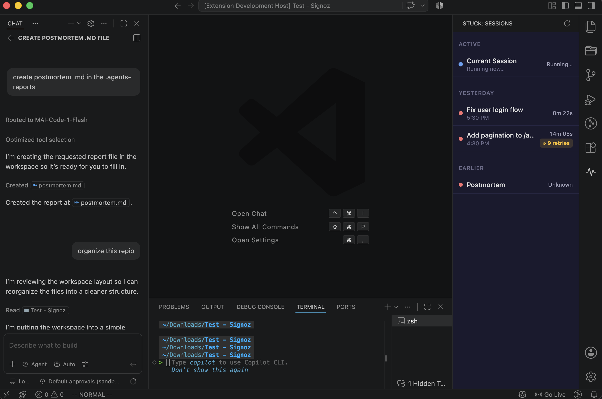
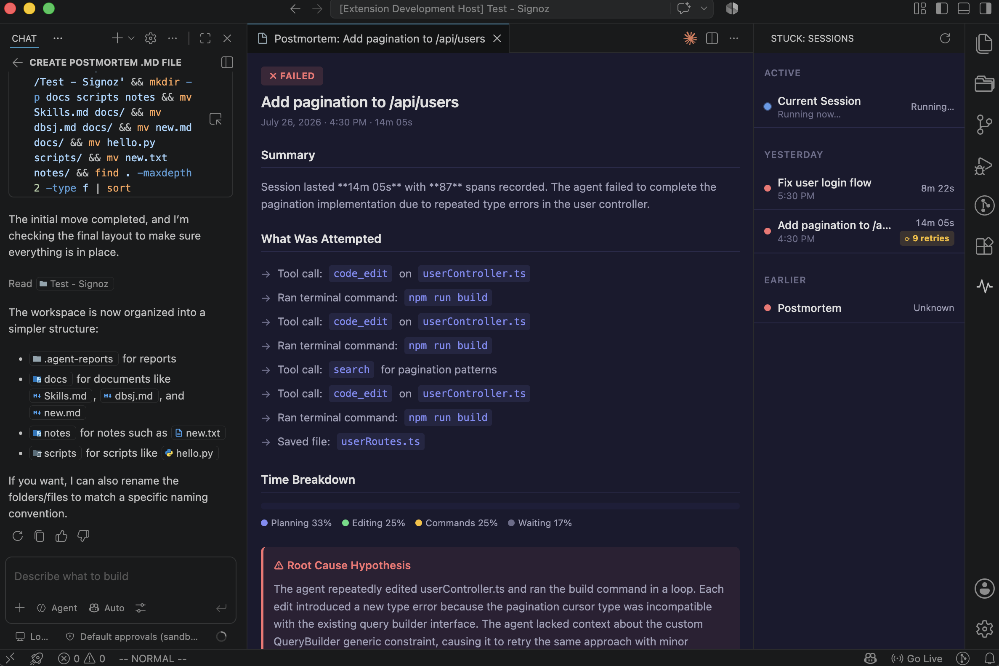
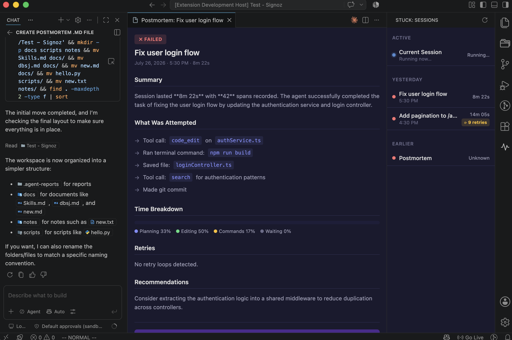
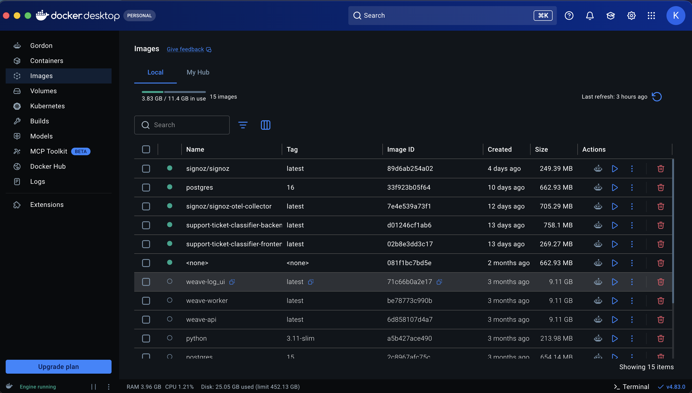
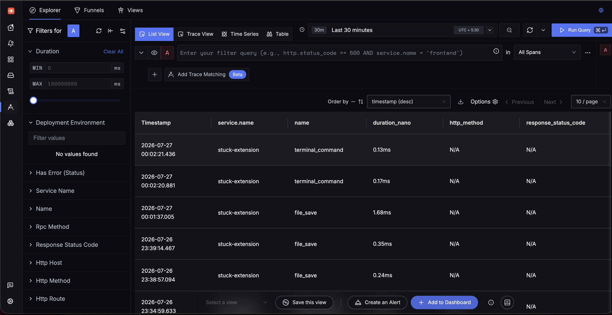

<div align="center">

# 🛑 STUCK
**Observability for AI coding agents.**

[](#)
[](#)
[](#)
[](#)
[](#)

*Traces what your agent actually does — file edits, terminal commands, git commits, tool calls — and generates a postmortem report when a task finishes or fails.*



Built as a VS Code extension. Runs on **Antigravity**, **Cursor**, and **VS Code**.

</div>

---

## 🚨 The Problem

AI coding agents operate as black boxes. You kick off a task, wait, and either get a result or a mess — with **no visibility** into what happened in between. There's no timeline of actions, no breakdown of time spent, and no record of retry loops or wasted cycles. When something goes wrong, you're left re-reading diffs and terminal output to reconstruct the story yourself.

**Stuck** fixes this by instrumenting agent activity as OpenTelemetry spans and sending them to a local SigNoz instance. When a session ends, it queries the trace tree and uses an LLM to generate a structured postmortem — what happened, where time was spent, what went wrong, and what to do differently next time.

---

## ✨ Features

- 📡 **Live Instrumentation** — file, terminal, and git spans flow to SigNoz in real-time.
- 🌉 **CDP Bridge (Antigravity only)** — captures agent tool calls and task signals via Chrome DevTools Protocol.
- 🔄 **Retry Loop Detection** — flags when the agent edits the same file or runs the same command 3+ times, with an in-editor warning.
- 📝 **Postmortem Reports** — LLM-generated session summaries with time breakdown, retry analysis, root cause, and recommendations.
- 🗂 **Session Sidebar** — grouped session list (Active / Recent / Yesterday / Earlier) in the activity bar with status dots.
- 🔍 **Rich Postmortem Viewer** — full-panel webview with structured report sections and a "View in SigNoz" deep-link.

<details>
<summary><b>Click to see Postmortem Examples</b></summary>
<br/>

**Failed Session (Caught in a Loop)**


**Successful Session**


</details>

---

## 📊 What It Traces

| Signal | Source | All IDEs | Antigravity Only |
|---|---|:---:|:---:|
| **File saves** (with byte delta) | VS Code API | ✅ | ✅ |
| **Terminal commands** (+ exit codes) | Shell Integration API | ✅ | ✅ |
| **Git commits** (files changed, line delta)| VS Code Git extension | ✅ | ✅ |
| **Agent tool calls** (file edits, searches) | CDP bridge | ❌ | ✅ |
| **Agent task lifecycle** (start/end) | CDP bridge | ❌ | ✅ |
| **Retry loop detection** | CDP bridge | ❌ | ✅ |

> 💡 **Cross-IDE honesty:** On Cursor and plain VS Code, stuck traces file/terminal/git activity — the same signals any extension can observe. The deeper agent-specific instrumentation (tool calls, task lifecycle, retry loops) requires Antigravity's CDP remote debugging port. 

---

## 🚀 Setup

### Prerequisites
- Node.js v18+
- Docker Desktop
- [foundryctl](https://github.com/SigNoz/foundry) (SigNoz deployment CLI)

```bash
curl -fsSL https://signoz.io/foundry.sh | bash
```

### 1. Clone and install
```bash
git clone https://github.com/ksploitx/stuck.git
cd stuck
npm install
```

### 2. Start SigNoz locally
The repo includes a `casting.yaml` for Foundry. Deploy it to spin up the full SigNoz stack in Docker.
```bash
foundryctl cast -f casting.yaml
```
Open `http://localhost:8080` and create your local account.
<br/>


### 3. Compile & Run
```bash
npm run compile
```
Press **F5** in VS Code / Cursor / Antigravity to launch the Extension Development Host.

**For Antigravity users** who want CDP bridge instrumentation, launch Antigravity with the remote debugging port enabled:
```bash
antigravity --remote-debugging-port=9000
```

---

## 🛠 Usage Walkthrough

1. **Start SigNoz** via `foundryctl` and launch the extension (**F5**).
2. **Work normally** or trigger an agent task (edit files, run commands).
3. **Watch the traces** flow into SigNoz in real-time.
   
4. **Wait for the postmortem** — after 5 minutes of inactivity (or task completion via CDP), a report is generated and saved to `.agent-reports/`.
5. **View the report** by clicking the Stuck icon (pulse) in the activity bar to see the session list, and open the rich postmortem viewer.

---

## ⚙️ Configuration

All settings are under **Settings → Extensions → Stuck**:

| Setting | Default | Description |
|---|---|---|
| `stuck.otlpEndpoint` | `http://localhost:4318` | OTLP HTTP endpoint for SigNoz |
| `stuck.cdpPort` | `9000` | CDP remote debugging port (Antigravity) |
| `stuck.cdpEnabled` | `true` | Enable/disable CDP bridge |
| `stuck.idleTimeoutMinutes` | `5` | Minutes of inactivity before triggering a postmortem report |
| `stuck.signozQueryEndpoint` | `http://localhost:3301` | SigNoz query-service API endpoint |
| `stuck.llmProvider` | `ollama` | LLM for reports (`ollama`, `anthropic`, `openai`) |
| `stuck.anthropicApiKey` | `""` | Anthropic API key for postmortem report generation |
| `stuck.openaiApiKey` | `""` | OpenAI API key for postmortem report generation |
| `stuck.ollamaEndpoint`| `http://localhost:11434`| Ollama API endpoint |
| `stuck.ollamaModel` | `llama3` | Ollama model name for postmortem report generation |

*(See package.json for full configuration options including API keys and timeouts).*

---

## 🚧 Known Limitations

* **CDP bridge is Antigravity-first:** The deepest instrumentation requires Antigravity's CDP remote debugging port. It silently degrades on standard VS Code / Cursor.
* **CDP heuristics:** Tool calls are inferred from Network requests and Runtime console output. Future API changes could break these heuristics.
* **Local-only SigNoz:** Everything runs locally via Docker.

---

## 📄 License
MIT
